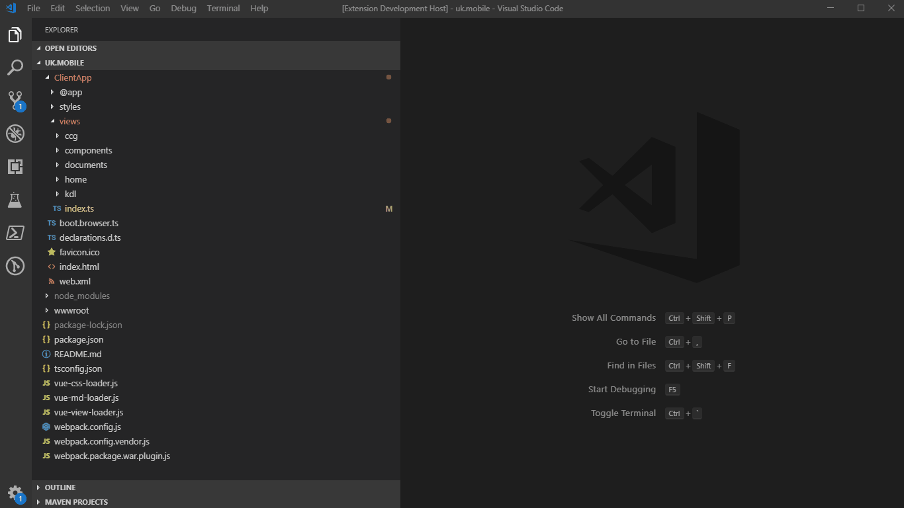

# Hướng dẫn sử dụng.
> `Phần mở rộng` này được sử dụng để hỗ trợ thao tác thêm một `view` mới vào dự án **UK Mobile** một cách nhanh chóng và thuận tiện hơn.
>  Chi tiết thao tác xem hướng dẫn và ảnh động ở bên dưới.

#### 1. Thêm một view (dành cho developer).
> Tất cả các `view` của **UK Mobile** đều được đặt trong thư mục `/ClientApp/views`. Để thêm một view mới, ta thao tác theo các bước sau:
>  Bước 1: Chuột phải vào thư mục `views`.
>  Bước 2: Chọn menu: `UK Mobile: Add component`.
>  Bước 3: Nhập đường dẫn (Ví dụ: `cps/001/a`, `001/a`, `a` hoặc: `cps\001\a`, `001\a`, `a`).
>  Bước 4: Khởi động serve bằng lệnh: `npm run start:dev` và truy cập vào đường link tương ứng với thư mục khởi tạo view để kiểm tra kết quả.
>  Bước 5: Nếu kết quả khởi tạo đúng. Đẩy toàn bộ những tập tin được tạo và thay đổi lên `github`.

** Hình minh hoạ **

#### 2. Thêm một control (dành cho kiban).
> Để thêm một `control` (`single file component`) vào **UK Mobile** ta làm theo những bước sau:
>  Bước 1: Chuột phải vào thư mục cần khởi tạo component.
>  Bước 2: Chọn menu: `UK Mobile: Add single component`.
>  Bước 3: Nhập tên file chứa component (Ví dụ: `nts-input-text`, `nts-input-number`,...).
>  Bước 4: Import component và code theo các hướng dẫn khác đã tạo mục `documents`.

** Hình minh hoạ **
